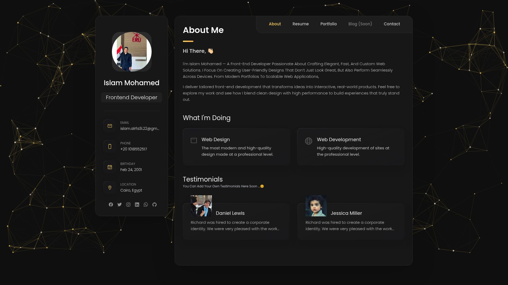

# Portfolio – Islam Mohamed

A modern portfolio built with Next.js (App Router) and Tailwind CSS. Includes About, Resume, Portfolio, and Contact sections. The Blog tab is disabled and labeled “Soon”.



## ✨ Features

- Responsive layout with sidebar and main content
- Portfolio category filter with project counts
- Internal sorting by `num` (asc/desc) in `Portfolio.jsx`
- Image fallback for project thumbnails
- Particles background and smooth UI

## 🧰 Tech Stack

- Next.js (App Router)
- React
- Tailwind CSS + custom CSS variables
- Ionicons (CDN)

## 🚀 Getting Started

1. Install dependencies

```bash
npm install
```

2. Run the dev server

```bash
npm run dev
```

Open `http://localhost:3000`.

3. Build & start

```bash
npm run build
npm start
```

## 🗂️ Structure (key files)

```
app/
  components/
    About.jsx
    Contact.jsx
    MainContent.jsx
    Navbar.jsx
    ParticlesBackground.jsx
    Portfolio.jsx
    Resume.jsx
    Sidebar.jsx
  globals.css
  layout.jsx
  page.jsx
public/
  images/
    project-photo/
```

## ⚙️ Configuration Notes

- Sorting: set `SORT_DIRECTION` in `app/components/Portfolio.jsx` to `"asc"` or `"desc"`.
- Images: looks for `public/images/project-photo/{num}.png` with a fallback to `picsum.photos`.
- Blog: disabled in `Navbar.jsx` (shows “Blog (Soon)”).

## 📦 Scripts

- `dev` – run local dev server
- `build` – production build
- `start` – run production server

## 📤 Deployment

Works well on Vercel. Ensure static assets exist in `public/`.

## 📫 Contact

- LinkedIn: https://www.linkedin.com/in/islam-mohamed-038240210/
- GitHub: https://github.com/Islam-mohamed-74
- Live demo : https://my-portfolio-six-eta-82.vercel.app/

---

Need badges, screenshots, or a live demo section? Tell me and I’ll add them.
